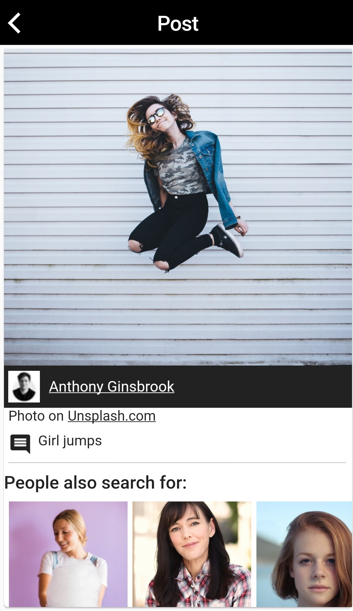
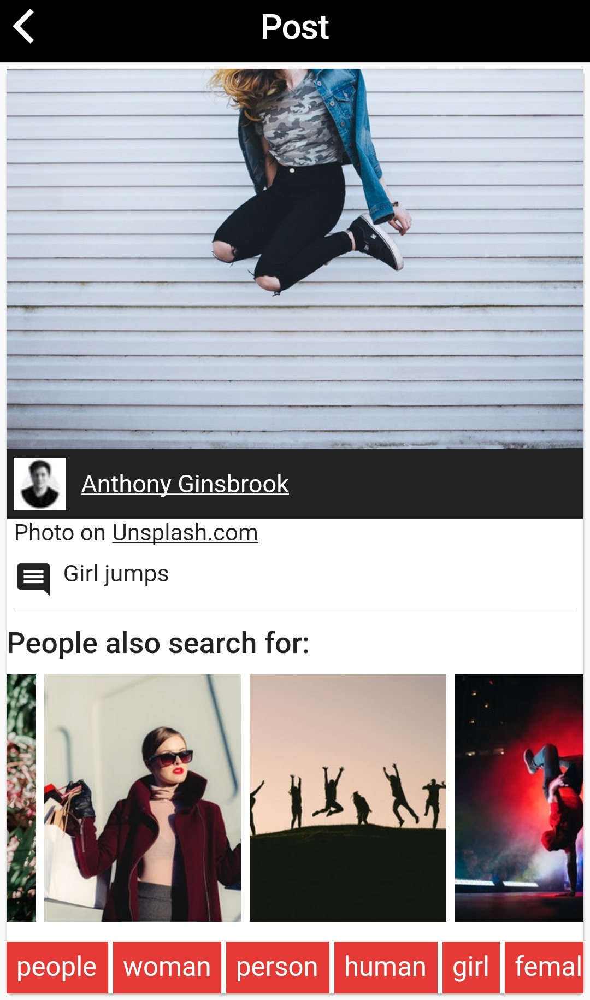

# Unsplash Images API

This is an app developed using the flutter framework. This app displays images taken from Unsplash Image API. It can also display images based on search request.

## Lets get Started

Create an account at https://unsplash.com/developers and register your app to get an access key.
This access key will be used to get search results


### Dependencies required : 
```
dependencies:
  http:
  flutter_staggered_grid_view:
  cached_network_image: ^0.8.0
  url_launcher:
  flutter_spinkit: "^3.1.0"
  flutter:
    sdk: flutter
```

To get search data from the api use - https://api.unsplash.com/search/photos?page=${page}&query=${image_query}&per_page=${Images_per_page}&client_id=${Your_Access_Key}

Save required information like username, image_url, description, etc..... in a list.

Design your app and use this list to provide information to it. 


### Scroll controller :
Use a scroll controller to implement infinite scrolling into the app.

Initialize a scroll controller :

```
var _scrollController = ScrollController();
```

Update _scrollController everytime scrolling reaches max extent.

```
@override
    void initState() {
    super.initState();
    //update UnsplashImages function and app new page to list
    UnsplashImages(Query);
    _scrollController.addListener((){
      if(_scrollController.position.maxScrollExtent == _scrollController.offset){
        setState(() {
           UpdatedInfo(Query); 
          });
      }
    });
  }
```

Use this controller for the controller parameter in staggered grid widget.

Finally dispose the controller.
```
@override
  void dispose() {
    super.dispose();
    _scrollController.dispose();
  }
```


---





